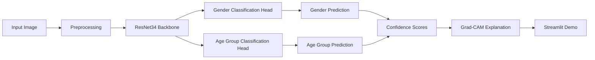
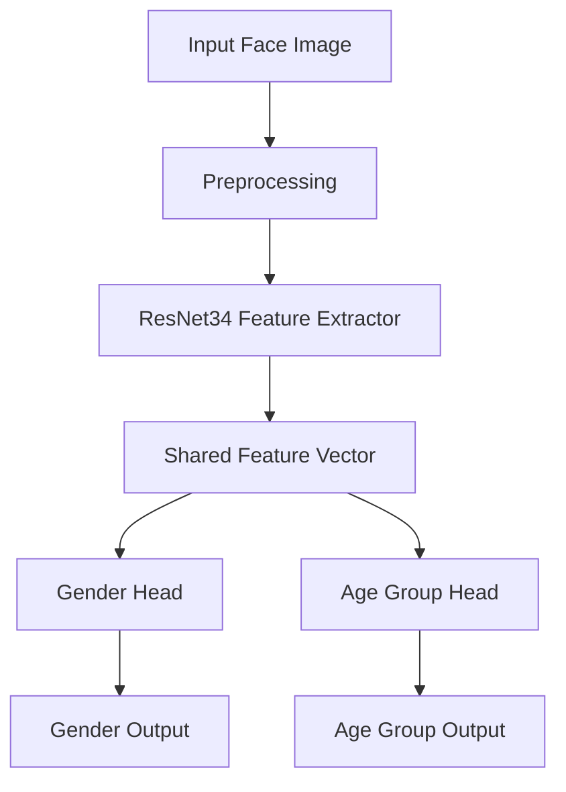
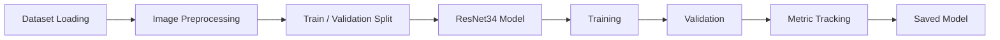

# Deep Learning Age & Gender Prediction

## Multitask ResNet34 Image Classification System

<p align="center">
  
  
  
  
  
</p>

---

## Project Overview

This project is a deep learning image classification system that predicts:

* Gender
* Age group

from a facial image using a **multitask ResNet34 model**.

The project is designed as a complete deep learning workflow:

```text
Image Dataset → Preprocessing → ResNet34 Training → Evaluation → Grad-CAM Explainability → Streamlit Demo
```

---

## Problem Statement

Age and gender prediction from images is a common computer vision task.

The goal of this project is not only to train a model, but to create a complete and usable deep learning demo that includes:

* Image upload
* Preprocessing
* Prediction
* Confidence scores
* Grad-CAM visual explanation
* Streamlit user interface

---

## Core Workflow



---

## Key Features

* Multitask deep learning model
* ResNet34 backbone
* Transfer learning
* Gender classification
* Age group classification
* Confidence score output
* Grad-CAM explainability
* Image upload interface
* Local Streamlit demo
* Clean project structure

---

## Tech Stack

| Category           | Tools            |
| ------------------ | ---------------- |
| Programming        | Python           |
| Deep Learning      | PyTorch          |
| Model Architecture | ResNet34         |
| Computer Vision    | Torchvision, PIL |
| Data Handling      | NumPy, Pandas    |
| Visualization      | Matplotlib       |
| Explainability     | Grad-CAM         |
| Demo UI            | Streamlit        |

---

## Prediction Targets

### Gender Classes

```text
Male
Female
```

### Age Group Classes

```text
Child
Young Adult
Adult
Senior
```

---

## Model Architecture



The model uses one shared CNN backbone and two task-specific output heads.

This approach is useful because the model learns shared visual features and then separates them into two prediction tasks.

---

## Project Structure

```text
deep-learning-age-gender-prediction/
│
├── app.py
├── README.md
├── requirements.txt
├── .gitignore
│
├── model/
│   ├── model_loader.py
│   └── multitask_resnet34.pth
│
├── src/
│   ├── preprocessing.py
│   ├── predict.py
│   ├── gradcam.py
│   └── utils.py
│
├── notebooks/
│   └── training_notebook.ipynb
│
├── assets/
│   ├── demo.png
│   ├── prediction_output.png
│   └── gradcam_output.png
│
└── docs/
    └── project_notes.md
```

---

## Example Output

```text
Input: Uploaded face image

Prediction:
Gender: Male
Gender Confidence: 92%

Age Group: Young Adult
Age Confidence: 84%

Explanation:
Grad-CAM highlights the facial region used by the model for prediction.
```

---

## How to Run Locally

### 1. Clone Repository

```bash
git clone YOUR-DEEP-LEARNING-PROJECT-LINK
cd deep-learning-age-gender-prediction
```

### 2. Create Virtual Environment

```bash
python -m venv .venv
```

### 3. Activate Environment

For Windows:

```bash
.venv\Scripts\activate
```

For macOS/Linux:

```bash
source .venv/bin/activate
```

### 4. Install Requirements

```bash
pip install -r requirements.txt
```

### 5. Run Streamlit App

```bash
streamlit run app.py
```

---

## Training Pipeline



---

## Evaluation

Add your final results here:

| Task                     | Metric   |     Value |
| ------------------------ | -------- | --------: |
| Gender Classification    | Accuracy | Add value |
| Gender Classification    | F1 Score | Add value |
| Age Group Classification | Accuracy | Add value |
| Age Group Classification | F1 Score | Add value |

---

## Explainability with Grad-CAM

Grad-CAM is used to visualize the regions of the image that influenced the model prediction.

This helps check:

* Whether the model focuses on the face
* Whether predictions are based on meaningful image regions
* Whether the model is affected by background noise
* Whether wrong predictions have understandable visual causes

---

## What This Project Demonstrates

This project demonstrates:

* Deep learning model development
* Transfer learning using ResNet34
* Multitask learning
* PyTorch training workflow
* Image preprocessing
* Model evaluation
* Explainable AI using Grad-CAM
* Streamlit demo development

---

## Limitations

* Predictions depend on dataset quality
* Age group classification can be harder than gender classification
* Lighting, pose, blur, and occlusion can affect results
* This is a learning/demo project and not intended for sensitive real-world identity decisions

---

## Future Improvements

* Add better dataset balancing
* Improve age group classification accuracy
* Add face detection before classification
* Add ONNX export
* Deploy Streamlit app online
* Add model confidence calibration
* Add batch image prediction

---

## Recruiter Summary

This project shows a practical deep learning workflow:

```text
Dataset → Preprocessing → ResNet34 → Multitask Prediction → Evaluation → Grad-CAM → Streamlit Demo
```

It highlights skills in:

* PyTorch
* CNNs
* Transfer learning
* Multitask learning
* Explainable AI
* Streamlit-based AI demos

---

## Author

**Sreekar**

<p>
  <a href="mailto:sreekar.germany.2025@gmail.com">
    
  </a>
  <a href="https://github.com/Sreekar-1804">
    
  </a>
</p>

